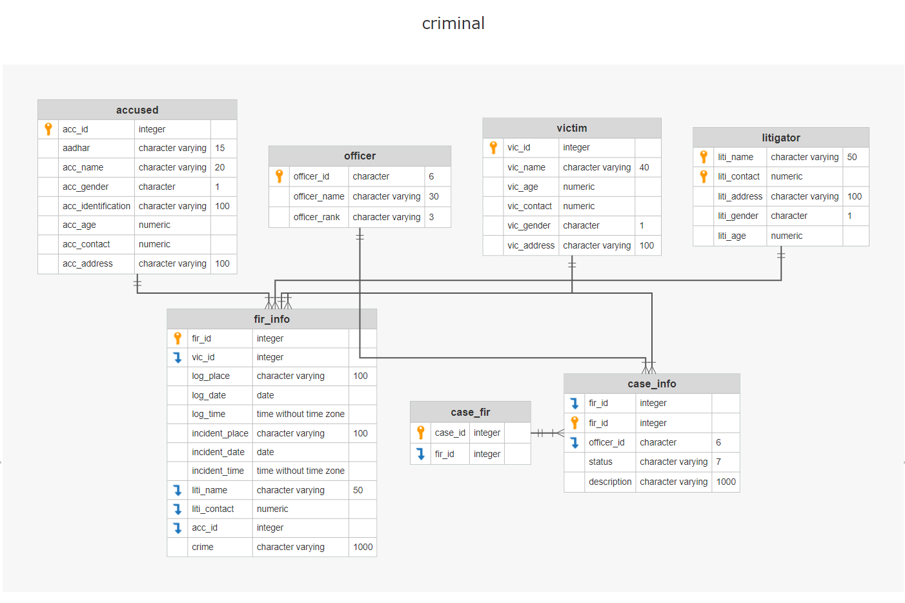

# Crimedata management
-----------------------------
## Requirements :
=================
- postgresql
- python
 



#### This is the schema of the tables in database ,Here the orange-key represents the primary key and the blue-Bent arrow represents the foreign keys. 


##### For all the other information related to the project refer to the report .

```  For this project I used DBever to work with the postgres and Jupyter-Notebook to work with python , And the 'queries' file contains the exact queries I used during the project creation ```
